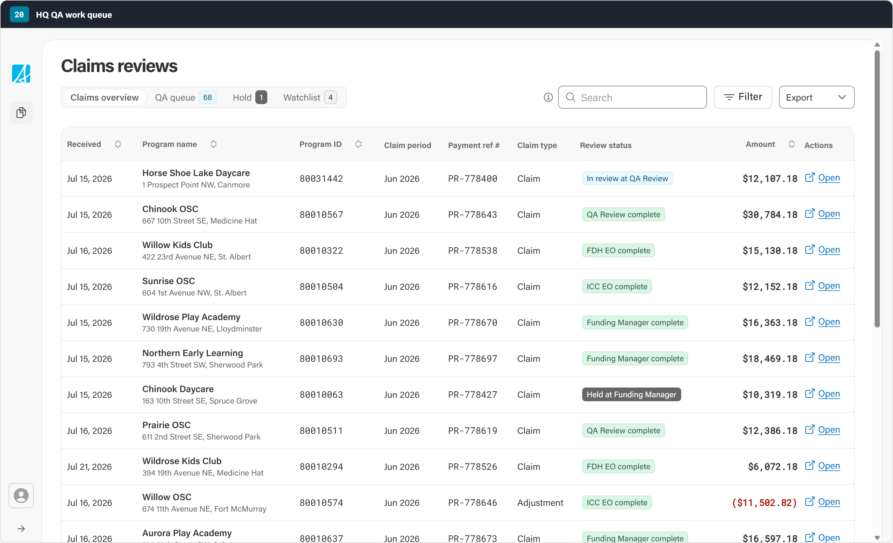

# HQ QA work queue — Claims reviews (MVP V1)

An implementation of the **MVP V1** Claims reviews screen for the Government of
Alberta HQ QA work queue, built on the **Government of Alberta Design System
v2** (`@abgov/react-components` 7.x + `@abgov/web-components` 2.x).

The screen is a worker tool: HQ QA reviewers scan childcare claims that have been
pulled for review, work through the QA queue, mark claims reviewed, and release
them back into the payment chain.

**Live prototype: <https://manadir-cgi.github.io/goa-claims-reviews-mvp/>**



## Running it

```bash
npm install
```

```bash
npm run dev
```

The app is served at `http://localhost:5173` (or the port Vite reports). Design
at a **1920 × 1170** viewport — that is the size the source artboard was drawn
at.

```bash
npm run build
```

## Deploying

`.github/workflows/deploy.yml` builds the app and publishes `dist/` to GitHub
Pages on every push to `main`, and can also be run on demand from the Actions
tab. Pages is configured with **GitHub Actions** as its source (not a branch), so
no `gh-pages` branch is involved.

`base: './'` in `vite.config.ts` keeps asset URLs relative, which is what lets the
build work from the `/goa-claims-reviews-mvp/` project path.

## What's implemented

**Four working sets**, as segmented tabs:

| Tab | Contents | Selectable |
| --- | --- | --- |
| Claims overview | Every claim in the review chain, with its current review stage | No — read-only roll-up |
| QA queue | Claims awaiting HQ QA, with the flag that pulled them in | Yes |
| Hold | Claims held at a review stage | Yes |
| Watchlist | Claims a reviewer is tracking | Yes |

**Bulk review flow** on the selectable tabs:

1. Select rows → the selection bar appears with `Add to watchlist`,
   `Place on hold`, `Mark reviewed`, and `Clear`.
2. `Mark reviewed` → each selected row gets a green reviewed marker, the control
   becomes a `Reviewed` state indicator, and a primary
   `Release N reviewed` action appears.
3. `Release N reviewed` → clears the marks and the selection.

**Table behaviour**: sortable Received / Program name / Program ID / Amount
columns, free-text search across program name, address, program ID and payment
reference, negative adjustments rendered as bracketed credits, and semantic
badges for review stage and flags.

## Structure

```
src/
  App.tsx                        composition root
  main.tsx                       DS bootstrap: tokens -> foundation -> app
  shell/ClaimsShell.tsx          GoabWorkspaceLayout + collapsed GoabWorkSideMenu
  claims-reviews/
    ClaimsReviews.tsx            the screen
    ClaimsReviews.css            layout-only styles, all values from GoA tokens
    data.ts                      sample fixture
docs/                            design reference exports (see below)
```

Every control on the screen is a real design-system component —
`GoabWorkspaceLayout`, `GoabWorkSideMenu`, `GoabTabs` (`variant="segmented"`),
`GoabTable` / `GoabTableSortHeader`, `GoabBadge`, `GoabButton`,
`GoabButtonGroup`, `GoabCheckbox`, `GoabContainer`, `GoabInput`, `GoabLink`,
`GoabMenuButton`, `GoabIcon`, `GoabTooltip`, `GoabText`, `GoabSpacer`. The
stylesheet carries layout only; type, colour and spacing come from GoA tokens.

## Sample data

All data in `src/claims-reviews/data.ts` is **deliberately fictitious**. The
program names, addresses, program IDs, payment references and amounts are
invented for the prototype and do not correspond to any real childcare program,
claim or payment.

`QA_QUEUE_TOTAL` is fixed at 68 to match the design's tab badge. The fixture
populates the first page of that queue rather than all 68 rows, so the badge
reads from that constant while the table renders the fixture.

## Known deviations from the design export

The source design was drawn with a Figma-derived component bundle, not with
`@abgov/react-components`, so its metrics and some of its styling do not match
the real design system. Where the two disagree, this build uses the real
design-system component:

- **Toolbar buttons.** The design shows `Filter` and `Export` with a neutral grey
  border and `#333` text. GoA DS v2 has no neutral-bordered button — the `dark`
  variant is only styled for `type="text"`, and the component logs a warning if
  you ask for it on `secondary`. These render as the real `secondary` button
  (blue border, blue text). Matching the design exactly would mean overriding DS
  colour tokens.
- **Row height and tab-strip width.** The design's row pitch and tab metrics do
  not correspond to DS defaults at any single scale factor. DS defaults are used.
- **Heading typeface.** The DS specifies `acumin-pro-semi-condensed`, a licensed
  font that is not bundled, so headings fall back down the DS font stack.
- **`Reviewed` state control.** The design shows a filled dark-green pill where
  `Mark reviewed` was. No GoA button variant is green, so this is a
  `GoabBadge type="success"` — a real DS component with that exact appearance,
  and semantically a state rather than an action.

## Design reference

`docs/` holds the four artboard exports this build was implemented against:
claims overview, QA queue, selection, and reviewed.

## Licence

[MIT](LICENSE)
